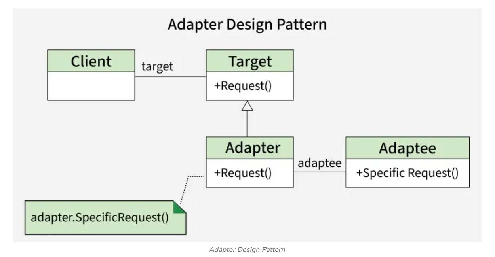
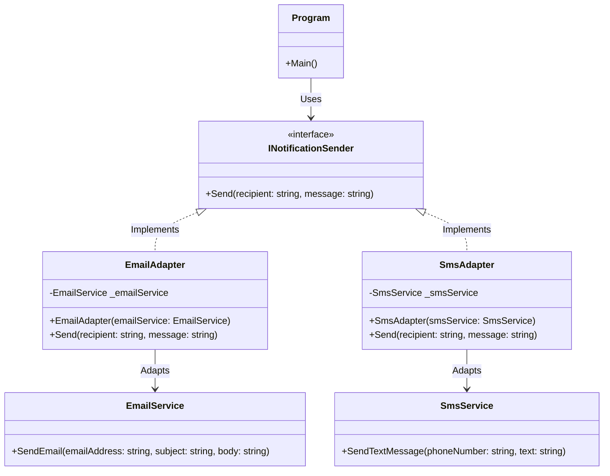

# 🔌 Adapter Pattern — Detailed Explanation

## 📖 What is the Adapter Pattern?

**Adapter Pattern** is a **Structural Design Pattern**.
It allows classes with **incompatible interfaces** to **work together**
by creating an intermediary class (Adapter) that translates one interface into another.

> 🔌 **Analogy:** Think of a **travel power adapter** —
> a Vietnamese plug (2 flat pins) does not fit a European outlet (2 round pins),
> but you don't need to buy a new device. You just need an **adapter** to bridge the shape difference.
> The Adapter is the **bridge** between two incompatible interfaces.

---


## 🏗️ Project Structure

```
AdapterPattern/
├── Target/
│   └── INotificationSender.cs   ← ⭐ TARGET — Standard interface used by the client
├── Adaptees/
│   ├── EmailService.cs          ← ADAPTEE 1 — Legacy email class (different API)
│   └── SmsService.cs            ← ADAPTEE 2 — Legacy SMS class (different API)
├── Adapters/
│   ├── EmailAdapter.cs          ← ADAPTER 1 — Wraps EmailService into INotificationSender
│   └── SmsAdapter.cs            ← ADAPTER 2 — Wraps SmsService into INotificationSender
├── Program.cs                   ← Client
└── AdapterPattern.md            
```

---


## 🧩 Components of the Adapter Pattern

The Adapter Pattern has **4 main components**:

| Component | Class in project | Role |
|---|---|---|
| **Target** | `INotificationSender` | The standard interface the client expects |
| **Adaptee** | `EmailService`, `SmsService` | Legacy classes with incompatible interfaces |
| **Adapter** | `EmailAdapter`, `SmsAdapter` | Bridge — implements Target, internally uses Adaptee |
| **Client** | `Program.cs` | Only knows the Target interface, unaware of Adaptees |

---

## 🔍 Component Breakdown

### 1. Target Interface (`INotificationSender`)

The standard interface that the **entire system** uses. The client only knows this interface:

```csharp
public interface INotificationSender
{
    void Send(string recipient, string message);
}
```

Simple — just 1 method with 2 parameters.

---

### 2. Adaptees — Incompatible Legacy Classes

These are **existing classes** whose APIs **differ from the Target**. We cannot (or do not want to) modify them:

**`EmailService`** — accepts 3 separate parameters:
```csharp
// EmailService API — DIFFERENT from INotificationSender
public void SendEmail(string toAddress, string subject, string body)
```

**`SmsService`** — completely different method name and parameters:
```csharp
// SmsService API — DIFFERENT from INotificationSender
public void SendTextMessage(string phoneNumber, string text)
```

> ⚠️ Neither class can be used **directly** where `INotificationSender` is expected.

---

### 3. Adapters — The Translation Layer ⭐

The Adapter is the heart of the pattern. It:
- **Implements** `INotificationSender` (so the client can use it)
- **Holds** an instance of the Adaptee (to invoke the real logic)
- **Translates** calls from the Target API → Adaptee API

**`EmailAdapter`:**
```csharp
public class EmailAdapter : INotificationSender   // ← Implements Target
{
    private readonly EmailService _emailService;  // ← Holds Adaptee

    public void Send(string recipient, string message)
    {
        // Translate: 2 standard parameters → 3 parameters of EmailService
        _emailService.SendEmail(
            toAddress: recipient,
            subject: "System Notification",
            body: message
        );
    }
}
```

**`SmsAdapter`:**
```csharp
public class SmsAdapter : INotificationSender     // ← Implements Target
{
    private readonly SmsService _smsService;      // ← Holds Adaptee

    public void Send(string recipient, string message)
    {
        // Translate: Send() → SendTextMessage()
        _smsService.SendTextMessage(
            phoneNumber: recipient,
            text: message
        );
    }
}
```

---

## ⚔️ Comparison: With vs Without Adapter

### ❌ WITHOUT Adapter — Client is tightly coupled to each service

```csharp
var emailService = new EmailService();
var smsService   = new SmsService();

// Send email — client must know the exact method name and parameters of EmailService
emailService.SendEmail("khach@gmail.com", "System Notification", "Order has been confirmed.");

// Send SMS — client must know the exact method name and parameters of SmsService
smsService.SendTextMessage("0901234567", "Order has been confirmed.");
```

**Problems:**
- ❌ Client is **directly coupled** to `EmailService` and `SmsService`
- ❌ **Cannot process multiple channels** generically in a loop or collection
- ❌ Adding a **new channel** (Zalo, Push Notification...) requires modifying the entire client code
- ❌ **Hard to test** because the client is tightly bound to concrete implementations

---

### ✅ WITH Adapter — Client only knows the standard interface

```csharp
// Create adapters — wrap legacy services into the standard interface
INotificationSender emailSender = new EmailAdapter(new EmailService());
INotificationSender smsSender   = new SmsAdapter(new SmsService());

// Client works with a list of interfaces — full polymorphism
var channels = new List<(INotificationSender sender, string recipient)>
{
    (emailSender, "khach@gmail.com"),
    (smsSender,   "0901234567"),
    (emailSender, "admin@company.com"),
};

// One piece of code handles every channel type
foreach (var (sender, recipient) in channels)
{
    sender.Send(recipient, "Order has been confirmed.");
}
```

**Benefits:**
- ✅ Client **does not know** and **does not need to know** the underlying service type
- ✅ Easily **handle multiple channels** generically in a single loop
- ✅ Adding a new channel only requires **creating a new Adapter**, no client code changes (**Open/Closed Principle**)
- ✅ Easy to **mock/test** because the client depends only on the interface

---

## 🆚 Adapter vs Facade

Both are **Structural Patterns** but solve different problems:

| Criteria | Adapter Pattern | Facade Pattern |
|---|---|---|
| **Purpose** | Make 2 incompatible interfaces work together | Simplify a complex interface |
| **Problem** | "This class has the wrong API and I can't change it" | "This system is too complex, the client needs a simpler API" |
| **Result** | Interface becomes **compatible** | Interface becomes **simpler** |
| **Changes interface?** | ✅ Yes — translates from interface A → interface B | ❌ No — just groups multiple steps into one |
| **Analogy** | Travel power adapter | Smart remote "Watch Movie" button |

---

## 📐 Flow Diagram

```
┌──────────┐      Send()        ┌──────────────┐    SendEmail()    ┌──────────────┐
│          │ ─────────────────► │ EmailAdapter │ ────────────────► │ EmailService │
│          │                    └──────────────┘                    └──────────────┘
│  Client  │      Send()        ┌──────────────┐  SendTextMessage() ┌────────────┐
│          │ ─────────────────► │  SmsAdapter  │ ────────────────► │ SmsService │
└──────────┘                    └──────────────┘                    └────────────┘

  Client only knows Send()       Adapter translates        Service executes
   (Target Interface)            to the correct API          (Adaptee)
```

### 🧩 Class Diagram (Mermaid)



---

## 🕐 When Should You Use the Adapter Pattern?

Use Adapter when:
1. You want to use an **existing class** but its interface **does not match** the system
2. You want to integrate a **third-party library** without directly depending on it
3. You need multiple **unrelated classes** to perform a **common task**
4. You want to **reuse** legacy code without rewriting it
