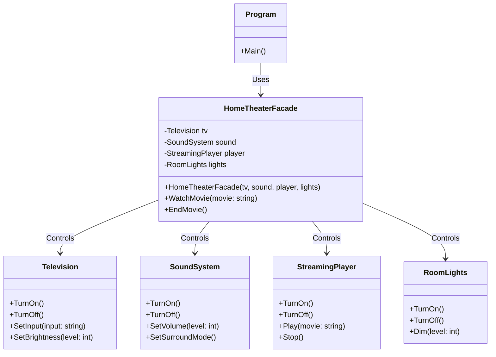

# 🎭 Facade Pattern — Giải thích chi tiết

## 📖 Facade Pattern là gì?

**Facade Pattern** (đọc: *fa-sád*) là một **Structural Design Pattern** (mẫu thiết kế cấu trúc).
Nó cung cấp một **giao diện đơn giản** (simplified interface) cho một **hệ thống con phức tạp**
(complex subsystem) gồm nhiều class, nhiều bước xử lý.

> 🏠 **Hình ảnh dễ hiểu:** Giống như khi bạn bấm nút "Xem phim" trên remote thông minh —
> bạn không cần tự bật TV, chỉnh HDMI, bật loa, chỉnh âm lượng, giảm đèn...
> Remote đã làm hết cho bạn. Remote chính là **Facade**.

---

## 🏗️ Cấu trúc dự án

```
FacadePattern/
├── SubSystems/              ← Các hệ thống con (subsystems)
│   ├── Television.cs        ← Điều khiển TV
│   ├── SoundSystem.cs       ← Điều khiển âm thanh
│   ├── StreamingPlayer.cs   ← Điều khiển trình phát phim
│   └── RoomLights.cs        ← Điều khiển đèn phòng
├── Facade/
│   └── HomeTheaterFacade.cs ← ⭐ LỚP FACADE — giao diện đơn giản
├── Program.cs               ← Demo so sánh có/không có Facade
└── FacadePattern.md         ← File giải thích bạn đang đọc
```

---

## 🔍 Giải thích từng thành phần

### 1. Subsystems (Hệ thống con)

Đây là các class **đã tồn tại** trong hệ thống, mỗi class quản lý một thiết bị:

| Class              | Chức năng                              |
|--------------------|----------------------------------------|
| `Television`       | Bật/tắt TV, chỉnh nguồn, độ sáng      |
| `SoundSystem`      | Bật/tắt loa, âm lượng, chế độ âm thanh|
| `StreamingPlayer`  | Bật/tắt, phát/dừng phim               |
| `RoomLights`       | Bật/tắt/giảm đèn phòng               |

Mỗi class hoạt động **độc lập**, client phải gọi từng class một.

### 2. Facade (`HomeTheaterFacade`)

Là class **bọc lại** tất cả subsystems và cung cấp **phương thức đơn giản**:

- `WatchMovie(string movie)` → Một lệnh duy nhất để bật toàn bộ hệ thống
- `EndMovie()` → Một lệnh duy nhất để tắt toàn bộ hệ thống

---

## ⚔️ So sánh: Có vs Không có Facade

### ❌ KHÔNG dùng Facade — Client phải tự xử lý mọi thứ

```csharp
// Client phải biết chi tiết từng bước, từng thiết bị
lights.Dim(10);
tv.TurnOn();
tv.SetInput("HDMI 1");
tv.SetBrightness(80);
sound.TurnOn();
sound.SetSurroundMode();
sound.SetVolume(60);
player.TurnOn();
player.Play("Avengers: Endgame");

// Khi kết thúc, lại phải tắt từng cái
player.Stop();
player.TurnOff();
sound.TurnOff();
tv.TurnOff();
lights.TurnOn();
```

**Vấn đề:**
- 😩 Client phải **biết tất cả** các subsystem
- 😩 Client phải **nhớ đúng thứ tự** gọi
- 😩 Code **lặp lại** mỗi khi muốn xem phim
- 😩 Nếu thêm thiết bị mới → phải **sửa tất cả** client
- 😩 **Khớp nối chặt** (tight coupling) giữa client và subsystems

### ✅ CÓ dùng Facade — Client chỉ cần 1 dòng

```csharp
var homeTheater = new HomeTheaterFacade(tv, sound, player, lights);

homeTheater.WatchMovie("Avengers: Endgame");  // ← Một lệnh duy nhất!
homeTheater.EndMovie();                         // ← Một lệnh duy nhất!
```

**Lợi ích:**
- 😊 Client **không cần biết** chi tiết bên trong
- 😊 Code **gọn gàng**, dễ đọc
- 😊 Thêm thiết bị mới → chỉ **sửa Facade**, client không đổi
- 😊 **Khớp nối lỏng** (loose coupling)
- 😊 **Một nơi duy nhất** quản lý logic điều phối

---

## 📊 Bảng so sánh tổng hợp

| Tiêu chí                | Không có Facade          | Có Facade                 |
|--------------------------|--------------------------|---------------------------|
| Số dòng code client      | ~10 dòng mỗi lần dùng   | 1 dòng mỗi lần dùng      |
| Client cần biết subsystem| ✅ Phải biết hết         | ❌ Không cần biết         |
| Thêm thiết bị mới        | Sửa tất cả client       | Chỉ sửa Facade           |
| Tái sử dụng              | Khó (copy-paste)         | Dễ (gọi lại Facade)      |
| Khớp nối (Coupling)      | Chặt (tight)             | Lỏng (loose)             |
| Phức tạp ban đầu         | Thấp                     | Cao hơn một chút         |

---

## 🎯 Khi nào nên dùng Facade Pattern?

✅ Khi hệ thống có **nhiều class phức tạp** tương tác với nhau

✅ Khi muốn cung cấp **giao diện đơn giản** cho client

✅ Khi muốn **giảm sự phụ thuộc** giữa client và subsystem

✅ Khi muốn **tổ chức hệ thống thành các lớp** (layers)

---

## 🔗 Sơ đồ quan hệ

```
┌─────────────────────────────────────────────────┐
│                    CLIENT                       │
│              (Program.cs)                       │
└───────────────────┬─────────────────────────────┘
                    │  Chỉ gọi Facade
                    ▼
┌─────────────────────────────────────────────────┐
│            HomeTheaterFacade                    │
│  ┌─────────────────────────────────────┐        │
│  │  WatchMovie(movie)                  │        │
│  │  EndMovie()                         │        │
│  └─────────────────────────────────────┘        │
└──┬──────────┬──────────┬──────────┬─────────────┘
   │          │          │          │  Facade gọi
   ▼          ▼          ▼          ▼  các subsystem
┌──────┐ ┌────────┐ ┌────────┐ ┌────────┐
│  TV  │ │ Sound  │ │ Player │ │ Lights │
└──────┘ └────────┘ └────────┘ └────────┘
```

### 🧩 Class Diagram (Mermaid)



---

## 💡 Lưu ý quan trọng

1. **Facade không ẩn subsystem** — Client vẫn có thể truy cập trực tiếp
   subsystem nếu cần chức năng chi tiết hơn.

2. **Facade không thêm chức năng mới** — Nó chỉ **đơn giản hóa**
   việc sử dụng các chức năng đã có.

3. **Có thể có nhiều Facade** — Một hệ thống lớn có thể có nhiều Facade
   cho các use case khác nhau (ví dụ: `MovieFacade`, `MusicFacade`...).
